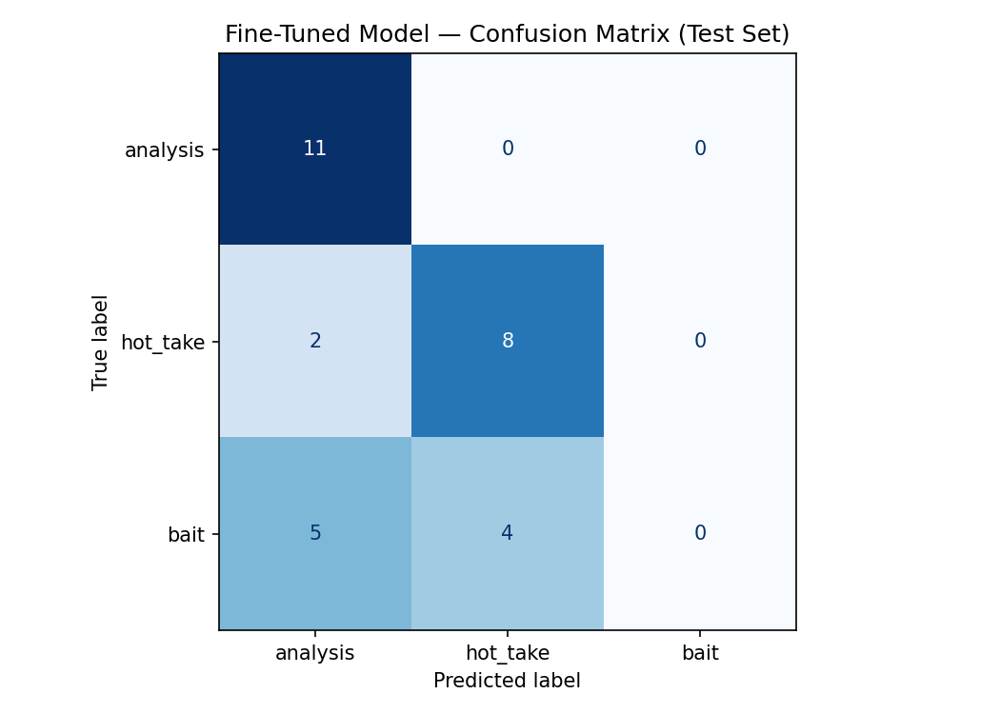

# ai201-project3-takemeter
A classification project for r/TheLastAirbender discourse, labeling posts as `analysis`, `hot_take`, or `bait`.

## Task
Classify posts from the Avatar fan community into exactly one of:
- `analysis`
- `hot_take`
- `bait`

The taxonomy is defined in `planning.md` and prioritizes whether a post is evidence-grounded, opinionated without strong evidence, or designed to provoke.

## Data
- Dataset: `data/loaded_dataset.csv` (200 labeled examples, columns: `text`, `label`, `notes`)
- Test set composition: 11 analysis, 10 hot_take, 9 bait (30 held-out examples)

### Source
Posts were collected manually by browsing r/TheLastAirbender across three queues, as planned in `planning.md`: **Hot/Top (all time)** to surface high-engagement bait and hot takes, **New** for a representative slice of everyday discourse, and **keyword search** ("theory," "breakdown," "essay," "unpopular opinion") to surface underrepresented labels — primarily `analysis`, which is naturally rarer. Post titles, body text, and top-level comments were all eligible, since bait often lives in the title while analysis often lives in the comments.

### Labeling process
Each post was labeled by hand against the three definitions and the `bait` vs. `hot_take` decision rule in `planning.md`. The `notes` column records the reasoning for borderline calls. For ambiguous posts, I applied the decision rule: strip the provocative framing and check whether a coherent, discussable point remains (`hot_take` if yes, `bait` if no); a falsifiable structural claim about the narrative goes to `analysis` even without cited scenes.

### Label distribution
| Label | Count | Share |
|---|---|---|
| `analysis` | 70 | 35% |
| `hot_take` | 70 | 35% |
| `bait` | 60 | 30% |
| **Total** | **200** | **100%** |

No single label exceeds 35% of the dataset, so the set is roughly balanced and no class dominates.

### Difficult examples and labeling decisions
1. **"Most Korra haters are a bunch of babies who can't handle her being different from Aang... [but] the show has problems"** → labeled **`hot_take`**. The opening phrasing reads like `bait`, but the post concedes that the show has flaws, so stripping the provocative framing still leaves a genuine opinion. The concession is what pulled it out of `bait`.
2. **"Azula did everything wrong... Tried to kill her own mother, and even kidnapp[ed]..."** → labeled **`bait`**. There is a real argument in the middle, but the last two sentences are a pure pile-on invitation. Per the decision rule, the provocative framing is structural to the post rather than incidental, so it resolves to `bait`.
3. **"So let me get this straight: Iroh using the spirit world as his personal retirement home is perfectly fine. Aang spending half of S3 on vacation in ENEMY TERRIT[ory]..."** → labeled **`analysis`**. Initially read as `bait` because of the sarcastic, exasperated tone, but there is a real falsifiable claim about inconsistent narrative treatment of characters underneath the rhetoric. Tone alone doesn't make a post bait if a discussable argument survives.

## Models

### Baseline
A zero-shot LLM classifier using **`llama-3.3-70b-versatile`** via the Groq API. The model was given the three label definitions and the `bait` vs. `hot_take` decision rule from `planning.md`, then asked to classify each test post into exactly one label. Results were collected by parsing the label out of each text response; accuracy is reported over the 30 parseable responses.

### Fine-tuned
**`distilbert-base-uncased`**, fine-tuned on the 200 labeled examples and trained in **Google Colab** using the HuggingFace `Trainer`.

**Key training decision — epochs.** Training started at the default **3 epochs**. Because the fine-tuned model collapsed the `bait` class (see Evaluation), I hypothesized the model was *underexposed* to `bait` and re-ran training at **5 and 10 epochs** to test it. Both gave essentially the same results — `bait` F1 stayed near zero and macro F1 did not recover — so additional epochs were not the bottleneck. This pointed the diagnosis away from under-training and toward the data distribution / `bait` signal itself (see Fix recommendations).

## Evaluation

### Summary (key metrics, same 30-example test set)
| Model | Accuracy | Macro F1 | `analysis` F1 | `hot_take` F1 | `bait` F1 |
|---|---|---|---|---|---|
| Baseline (Groq `llama-3.3-70b`, zero-shot) | 0.900 | 0.90 | 0.95 | 0.87 | 0.88 |
| Fine-tuned (`distilbert-base-uncased`) | 0.633 | 0.495 | 0.759 | 0.727 | 0.00 |

**Headline:** the zero-shot baseline outperformed the fine-tuned model (macro F1 0.90 vs. 0.495). The fine-tuned model collapsed the `bait` class entirely (F1 0.00) and fell below the `planning.md` minimum bar (macro F1 0.70, no class below 0.60). Full breakdown and confusion matrix below.

### Baseline results
- Accuracy: 0.900 on 30 parseable responses
- Per-class metrics:
  - `analysis`: precision 1.00, recall 0.91, f1 0.95
  - `hot_take`: precision 0.77, recall 1.00, f1 0.87
  - `bait`: precision 1.00, recall 0.78, f1 0.88
- Macro F1: 0.90

### Fine-tuned results
- Accuracy: 0.6333 on the same 30-example test set
- Per-class metrics:
  - `analysis`: precision 0.611, recall 1.00, f1 0.759
  - `hot_take`: precision 0.667, recall 0.80, f1 0.727
  - `bait`: precision 0.00, recall 0.00, f1 0.00
- Macro F1: 0.495
- Weighted average F1: 0.521

### Fine-tuned confusion matrix
| True \ Predicted | analysis | hot_take | bait |
|---|---|---|---|
| analysis | 11 | 0 | 0 |
| hot_take | 2 | 8 | 0 |
| bait | 5 | 4 | 0 |

## Error analysis
### AI-assisted pattern review
I planned to use an AI tool to search for error themes, but the local environment did not provide accessible OpenAI, Anthropic, or HuggingFace API access. I instead manually verified patterns from the saved misclassifications and the confusion matrix.

The main pattern is that the fine-tuned model completely lost the `bait` category. All 9 bait examples were misclassified as either `analysis` or `hot_take`, while `analysis` remained strong when evidence was present.

### What the model got wrong
1. **Hot_take → analysis**
   - "Why couldn't the creators just have Korra Asami and Mako in a relationship?? I mean if you gonna promote same-sex relationships why not have a poly relationship between the 3..."
   - The post is an opinionated shipping complaint, not a grounded argument. The model mistook longer complaint style for analysis.

2. **Bait → analysis**
   - "ATLA fans are stuck in childhood. Grow up and watch something made for adults."
   - This is direct provocation with no evidence. The model incorrectly treated the blunt insult as argumentative.

3. **Bait → hot_take**
   - "I swear that if the zutara shippers can just accept that their ship isn't endgame and stop misinterpreting canon to justify it there wouldn't be so much hate coming from the other side."
   - The sentiment is opinion, but the intent is clearly to provoke fans. The classifier captured opinion content but missed the bait framing.

### Confused label boundaries
- The dominant confusion is `bait` being collapsed into `analysis` or `hot_take`.
- The `bait` vs `hot_take` boundary is especially weak because both can use strong opinion language.
- The model sometimes overweights length or disagreement tone rather than the structure of evidence-based reasoning.

### Labeling vs prompt/data issue
- This appears to be a training/data problem rather than annotation inconsistency. The examples match the definitions in `planning.md`, but the fine-tuned model still failed to preserve the intended `bait` signal.
- The likely cause is insufficient or poorly emphasized `bait` examples during fine-tuning and a prompt that did not preserve the distinction.

### Fix recommendations
- Add more explicit `bait` examples that are similar in length to `hot_take` but clearly provocation-oriented.
- Tighten the prompt to emphasize rhetorical intent, not just sentiment.
- Review training data for mislabeled or ambiguous `bait` examples before re-running fine-tuning.

## Sample classifications
| Post excerpt | True label | Predicted label | Confidence |
|---|---|---|---|
| "Why couldn't the creators just have Korra Asami and Mako in a relationship??..." | hot_take | analysis | 0.37 |
| "ATLA fans are stuck in childhood. Grow up and watch something made for adults." | bait | analysis | 0.36 |
| "I swear that if the zutara shippers can just accept that their ship isn't endgame..." | bait | hot_take | 0.36 |
| "Roku's mistake wasn't, that he didn't stop Sozin. His mistake was not listening to Sozin..." | analysis | analysis | N/A |

For the correctly predicted analysis example, the text includes causal reasoning about narrative choices and specific story events, which matches the `analysis` label.

## Reflection
### What the model captured
- The fine-tuned model still detects explicit analysis when reasoning or story structure is present.
- It can recognize straightforward opinion statements as `hot_take`.

### What the model missed
- `bait` was effectively eliminated as a distinct label.
- The classifier overfit to evidence-like language and underfit rhetorical intent.

### Why that matters
The project is intended to surface discourse type, not just sentiment. Losing `bait` makes the classifier less useful because the main value is identifying posts designed to provoke rather than posts that simply express an opinion.

## Spec reflection
- The spec helped by making the confusion matrix and per-class metrics explicit evaluation requirements, which focused analysis on the right failure modes.
- The implementation diverged because the fine-tuned model performed worse than the baseline and failed to preserve the `bait` label. That divergence likely stems from a training prompt or data distribution issue during fine-tuning.

## AI usage
My AI Tool Plan (`planning.md`) had two uses: label stress-testing before annotation, and failure analysis after evaluation.

### Label stress-testing (before annotation)
Before labeling, I gave Claude my three label definitions and the `bait` vs. `hot_take` decision rule, then asked it to generate 10 synthetic posts sitting on label boundaries — 5 at the `bait`/`hot_take` boundary and 5 at the `hot_take`/`analysis` boundary, the two pairs most likely to cause annotator disagreement. I then applied my decision rule to each generated post; any hesitation flagged an under-specified definition. I looked specifically for posts where the rule flips depending on how generously I read them, and posts where one label's key signal (e.g., an episode reference) co-occurs with another's (e.g., absolutist language). Cases I couldn't resolve cleanly were promoted to the Hard Edge Cases section with an explicit decision rule added before annotation began.

### Failure analysis (after evaluation)
I planned to export the model's wrong predictions as (post text, true label, predicted label) triples and give them to Claude with the prompt: *"Here are posts my classifier got wrong. Identify patterns in the mistakes. Are certain topics, post lengths, rhetorical structures, or phrasings systematically misclassified? Group the errors and describe what they have in common."* I intended to look for topic bleed (errors clustered around specific subjects), length artifacts (short posts defaulting to `hot_take`), and framing false positives (`hot_take` posts misread as `bait` for strong language alone), and to manually read every post in each proposed cluster to confirm the pattern before including it in the writeup.

In practice, the local environment did not provide accessible OpenAI, Anthropic, or HuggingFace API access, so I could not run the AI-assisted pattern review. I instead manually verified the patterns from the saved misclassifications and the confusion matrix, as documented in the Error analysis section above.

### Specific instances of AI use
1. **Label stress-testing (directed → overrode).** I directed Claude to generate 10 boundary posts and suggest a label for each. Where I disagreed with its suggested label, I overrode it using my decision rule, and any case I couldn't resolve cleanly I promoted into the Hard Edge Cases section with an explicit rule rather than accepting the model's call. The model proposed the examples; I owned the final taxonomy.
2. **README / evaluation report structuring (directed → revised).** I used the in-IDE AI assistant to draft the structure of this README and check it against the submission checklist. I revised every section by hand — in particular correcting all reported metrics, the confusion matrix, and the error-analysis examples against the actual `evaluation_results.json` and saved predictions, since drafted numbers cannot be trusted.

**Annotation disclosure.** All 200 labels were assigned manually against the `planning.md` definitions; no AI tool was used to pre-label or auto-label the dataset. (The Groq `llama-3.3-70b-versatile` model appears only as the zero-shot *baseline classifier* being evaluated, not as an annotation aid.)

## Notes
- The current fine-tuned model is behind the baseline. The next step is to re-tune with a stronger `bait` signal and a clearer prompt for the `bait` vs `hot_take` boundary.
